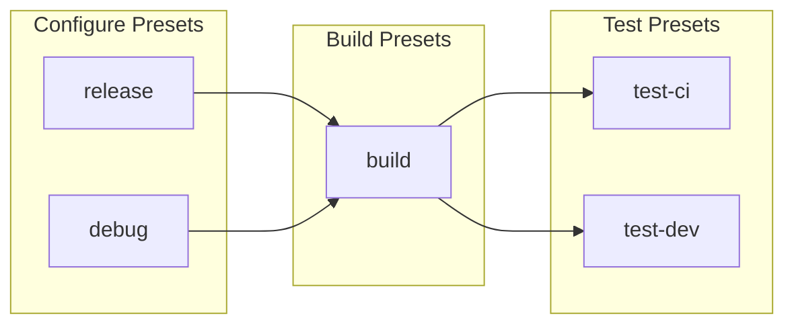
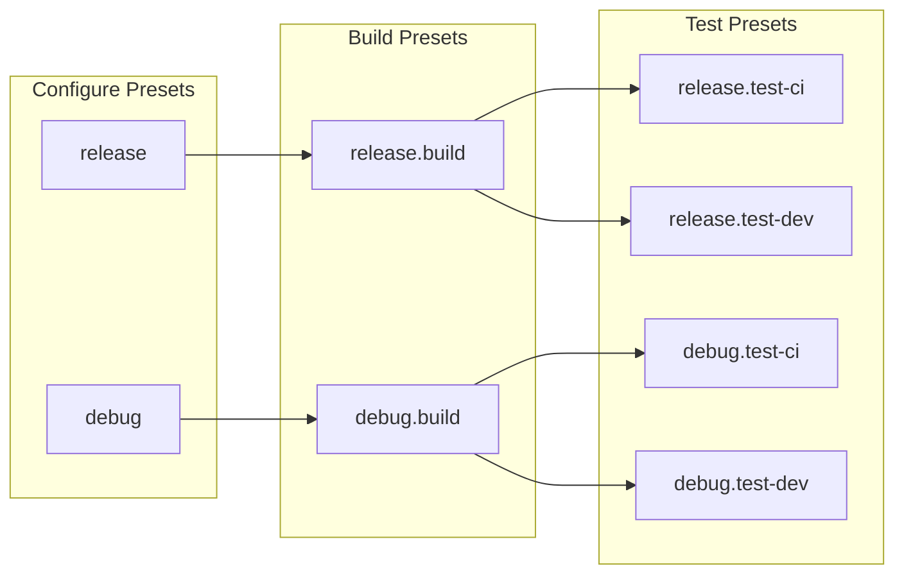

# Design

```mermaid
flowchart LR
  subgraph Configure Presets
    release
    debug
  end
  subgraph Build Presets
    build
  end
  subgraph Test Presets
    test-ci
    test-dev
  end

  release --> build
  debug --> build

  build --> test-ci
  build --> test-dev

  %% release --> test-ci
  %% release --> test-dev
  %% debug --> test-ci
  %% debug --> test-dev
```

```mermaid
flowchart LR
  subgraph Configure Presets
    release
    debug
  end
  subgraph Build Presets
    release.build
    debug.build
  end
  subgraph Test Presets
    release.test-ci
    release.test-dev
    debug.test-ci
    debug.test-dev
  end
  release --> release.build
  release.build --> release.test-ci
  release.build --> release.test-dev
  debug --> debug.build
  debug.build --> debug.test-ci
  debug.build --> debug.test-dev
```
